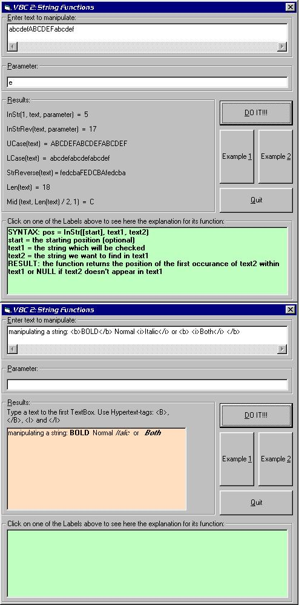



## VB Compendium for Beginners \(Part II\)

### Description

It's the second part of my huge VB Compendium. This project has two examples on how to manipulate Strings (and print formated text to a PictureBox) The first example is only to demonstrate some VB String-functions; the second uses them to format a text with hypertext tags. Part III soon available ;) If you like any project please vote for it!
 
### More Info
 

             |
---                |---
**Submitted On**   |2001-12-04 15:58:40
**By**             |[GammaRay](https://github.com/Planet-Source-Code/PSCIndex/blob/master/ByAuthor/gammaray.md)
**Level**          |Beginner
**User Rating**    |5.0 (15 globes from 3 users)
**Compatibility**  |VB 6\.0
**Category**       |[Coding Standards](https://github.com/Planet-Source-Code/PSCIndex/blob/master/ByCategory/coding-standards__1-43.md)
**World**          |[Visual Basic](https://github.com/Planet-Source-Code/PSCIndex/blob/master/ByWorld/visual-basic.md)
**Archive File**   |[VB\_Compend393751242001\.zip](https://github.com/Planet-Source-Code/gammaray-vb-compendium-for-beginners-part-ii__1-29465/archive/master.zip)

